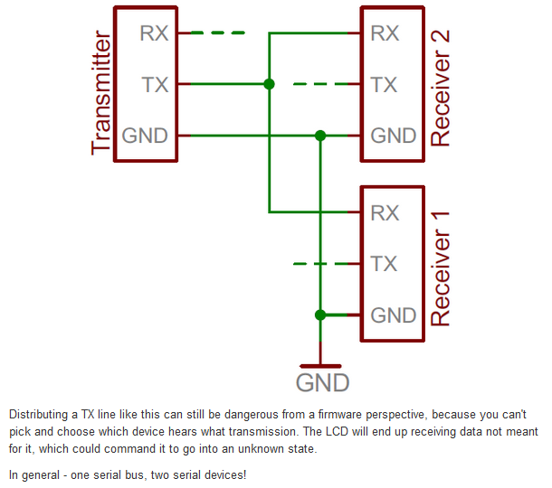
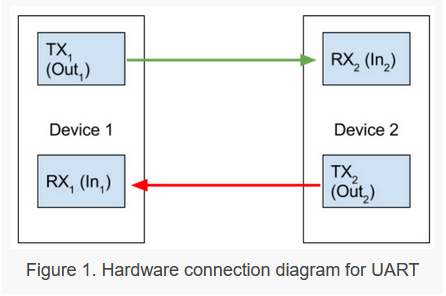
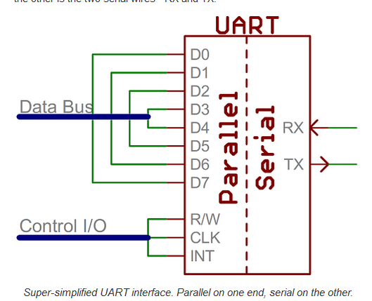
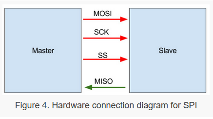
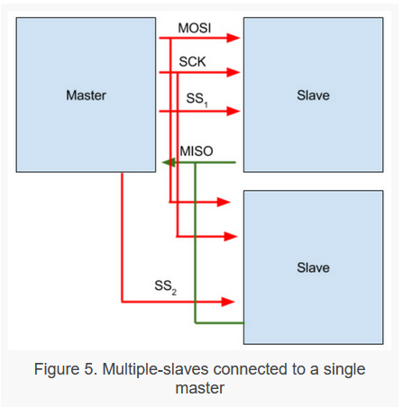

# Arduino Communication Protocols

[Resource](https://www.deviceplus.com/arduino/arduino-communication-protocols-tutorial/)

# Binary & Number Systems

Digital Signal

- data is transferred as a sequence of high to low and low to high switchings that occur very rapidly

Protocols

- UART, SPI, $I^2C$
  > Use:transferring data at high speeds to any compatible device.

Bits

- hi: 1
- lo: 0

Base 10 System

- ones: $10^0$
- tens: $10^1$
- hundreds: $10^2$
  > 567 \
  > 5 _ $10^2$ , 6 _ $10^1$ , 7 \* $10^0$
- each digit can be `0-9`

Bytes - Base 2 system

- group of 8 bits
- `10100001`
- each digit can be either `1 or 0`
  > `10100001` \
  > $1*2^7, 0 * 2^6, 1* 2^5,...,1 * 2^0$ \
  > $1*2^7+1*2^5+1*2^0 = 161 $

Prefixes

- Binary: `0b`
- Octal: `0`
- Hexadecimal: `0x`
- Decimals have `no prefix`

# UART Communication Protocol

[Additional Reference](https://learn.sparkfun.com/tutorials/serial-communication)

`Universal Asynchronous Receiver/Transmitter`

- Serial Communication between `2 devices` at a time
- Half Duplex
- Act as an intermediary between parallel and serial interfaces
- data transferred via bits
- `Onboard hardware` that manages packaging and translation of serial data
  - `USB`: Universal Serial Bus is a serial port
  - Typically this connection is in two digital pins [`(General Purpose Input/Output)`](https://www.deviceplus.com/raspberry-pi/an-introduction-to-raspberry-pi-gpio-pins/)
    - `GPIO 0`
    - `GPIO 1`
    - can provide or receive hi/lo voltage
    - primary use is communication
- No need to work in binary, can use SoftwareSerial libraries to implement UART

Asynchronous Commuication

- does not depend on a synchronized clock signal between two devices
- data needs to be sent in fixed sized chunks to ensure it is received or sent
- slower than synchronized communications

Packets

- pre-defined size
- start & end of message
  - transmit line is brought low to indicate start of message
- confirmation of message received

Bus Contention

- an issue that occurs if more than 2 devices try to communicate over UART
- unusable data

Advanced UARTs

> More advanced UARTs may throw their received data into a buffer, where it can stay until the microcontroller comes to get it. UARTs will usually release their buffered data on a first-in-first-out (FIFO) basis. Buffers can be as small as a few bits, or as large as thousands of bytes.

Wiring

- `TX`: Transmitting
- `RX`: Receiving
- Serial port

# SPI Communication Protocol

`Serial Peripheral Interface `

- Synchronous (higher speeds)
- Follows a Master-Slave Model
  - One master & several slaves
- Wiring is more than 2 lines
- Full-Duplex
  - communication always occurs bidirectionally; even if the application only requires one direction
  - implemented with a `shift register`

Wiring

- `MOSI`: Master out slave in
  - transmission line from master
- `SCK`: Clock line
  - defines transmission speed and transmission start/end
  - a square wave of fixed-frequency
  - `CPOL`: Clock Polarity
    - idle state either HI or LO of clock signal; placed in this state when not communicating with slaves; stays in either HI/LO when in idle to conserve power
  - `CPHA`: Clock Phase (`0-1st edge, 1-2nd edge`)
    - edge of the signal upon which data is captured
    - square wave has 2 edges (rise/fall)
    - depending on setting; data is either captured in rising or falling edge
- `SS`: Slave Select
  - Line for master to select a slave
- `MISO`: Master in slave out
  - Transmission line from slave

Multi-Slave and `GPIO`

> The master device decides which slave it is communicating with through a separate SS line for each slave. This means that each additional slave that the master communicates with requires another GPIO pin on the master’s side.

# $I^2C$ Communication Protocol

`Inter-Integrated Circuit`

- Half-Duplex
- ability to connect multiple masters to multiple slaves
- Synchronous (higher speeds)
- Simple Wiring
  - requires only 2 wires and some resistors
    - These are analog pins
    - `SDA`: data line
    - `SCL`: clock line
  - Idle: pulled HI
  - In communication: pulled LO through MOSFETS

Selecting Slaves

- no longer through separate digital lines but through unique byte addresses

# Parallel Vs. Serial

Parallel

- transfer multiple bits at the same time
- require buses of data (largeF)
- transmit across 8,6, or more wires
  

Serial

- transmits one bit every clock pulse
- two wires
- Rules
  - `Data bits`
  - `Sync bits`
    - start and stop bits
  - `Parity bits`
  - `Baud Rate`

Types of Serial Protocols

- USB Universal Serial Bus
- Ethernet
- SPI (sync)
- $I^2C$ (sync)

## Baud Rate

- how fast data is sent over a serial line
- units: `bit-per-second (bps)`
- $\frac{1}{\text{Baud Rate}}$
  - how long the transmitter holds a serial line HI or LO or at what period the receiving device samples its line
- standard rate: 9600 bps
- the higher the rate the faster the transmission
  - Upper limit ~ `115200 bps`
