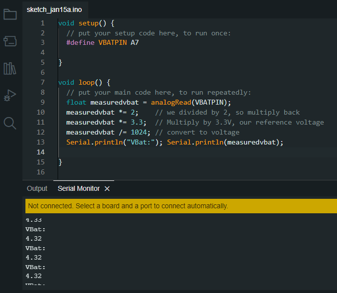

# Current Trials

## Notes

- There is a program Putty that might be able to take serial output and create data files
  - May not be needed, I'm able to read in data to terminal
- need to determine the timing involved
  - this will open and read files one at a time, (quickly) but how quickly is currently unknown
  - putty is it a good option?

## Results of 4/4/23 Trial

- A protocol on the Adalogger can be set and then on a separate computer we can control it via the python program.
- Conclusion: we can proceed with the python GUI

## Results of 2/10/22 Trail

- huge success! we are able to write/read/delete files.
- Succssful serial + unicode communication between python script and arduino
- Files:
  - `scripts > blinkRedGreenWithPyton.ino`
    - upload ready, parameters `(ON/OFF/exit)`
  - `pythonEnv > tests > serial_send_LED.py`
    - terminal run, checks for ports , port used (COM4)

# Successful Trials

> - Blink
> - [Measuring Battery](https://learn.adafruit.com/adafruit-feather-m0-adalogger/power-management)

## Write/Read/Read Card Contents

> - Successful in reading, writing, open, closing, deleting files from SD card from the IDE script.

# Past Failed Trials

- DumpFile
  - File > Examples > SD > DumpFile
  - `RESOLVED`: the DumpFile takes the contents of the file and "dumps" it to the serial monitor to be viewed by user.

- Check Secure Digital (SD) Card Info
  - File > Examples > SD > CardInfo
  - this shows the txt files are 0 bytes and should be attempted again
  - `RESOLVED`: The proper code snippets were found and we can now write to file - See any of the read or write scripts
    
